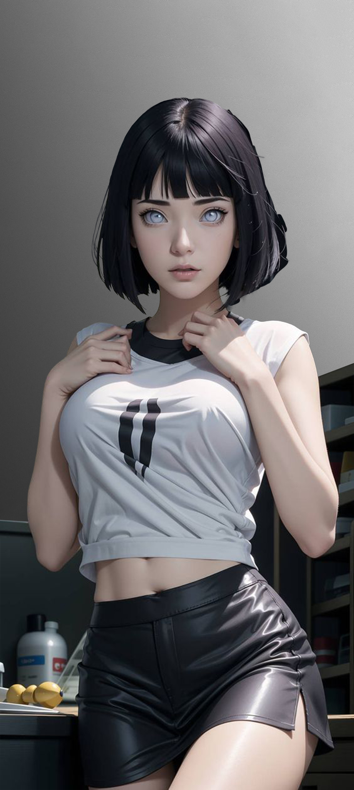

# serdykee.github.io

A Jailed toolbox application for iOS 14.0-15.7.1 and 16.0-16.1.2 using [CVE-2022-46689](https://support.apple.com/en-us/HT213530).

Enable Notifications and set Location Services to **Always** to keep the app running in the background, keep the dock and folder background hidden, and prevent some sound effects from reverting.

Warning: Some changes are permanent on iOS 14.0-14.8.1

IPA available in the [Releases](http://serdykee.github.io) section.

Truy cập trang web tại [http://serdykee.github.io](http://serdykee.github.io) to be featured in the home screen and to get access to exclusive private beta builds!

## Screenshots
           

## Features
- Running in the background to keep some changes from reverting
    - From running tests, battery loss is negligible (~1% per day on frequent), but that may vary

- Springboard
    - Hide dock
    - Hide home bar
    - Hide folder backgrounds
    - Disable library pod background
    - Disable folder background blur
    - Disable app switcher blur
    - Hide CC Module Backgrounds
    - Hide Notification Banner Background
    - Notification Banner Shadow

- App Icon Themes
    - Importing folders of app icons
    - No WebClips!

- Explore
    - Find and download themes for passcodes, locks, and app icons!
    - If you would like to submit your own works, please [join the discord](http://serdykee.github.io)

- Status Bar
    - Change carrier name
    - Change secondary carrier name
    - Change battery display detail
    - Change time text
    - Change breadcrumb text
    - Show numeric WiFi/Cellular strength
    - Hide many icons in the status bar

## Installing
You can install through AltStore, Sideloadly, Xcode, or TrollStore (if your device supports it)

## Creating Custom Lock Animations
Lock animations are very simple to make. For the frames, each image must be named "trollformation" with a number afterwards (ie. trollformation1.png, trollformation2.png, trollformation3.png...). You can use up to 120 frames, though I am not sure of the exact size limit, which is probably much less.
**If your animation is not exactly 40 frames or you want to customize the display length of each frame, you need to define the animations.** This is very simple to do:
1. Create a json file named `animations.json`
2. Define the values. Format: `"Frame Number": Time Interval`
Example:
```
{
    "1": 0,
    "2": 0.025,
    "10": 0.01,
    "15": 0.025
}
```
**Explanation:**
You do not need to state the length of each frame. The only time that absolutely needs to be defined is the first frame. If you did not set a time for the frame, Cowabunga will use the time from the last frame.
The `Time Interval` is how long the frame stays on the screen for.
**Important:** The frame number must be a string (meaning in quotes) because of how json decoding works.

## Building
Just build like a normal Xcode project. Sign using your own team and bundle identifier. You can also build the IPA file with `ipabuild.sh`.

## Credits
- [TrollTools](https://github.com/sourcelocation/TrollTools) for ipabuild.command, carrier changer logic, alerts UI, and update inbounds message.
- [FontOverwrite](https://github.com/ginsudev/WDBFontOverwrite) for exploit code and fonts.
- [SourceLocation](https://github.com/sourcelocation) for the explore page and v8 and v10 icon theming.
- [BomberFish](https://github.com/BomberFish) for AirPower sound.
- [c22dev](https://github.com/c22dev) for fixing AirPower and some included audios.
- [DynamicCow](https://github.com/matteozappia/DynamicCow) for DynamicIsland tweak + improved plist function.
- [Evyrest](https://github.com/sourcelocation/Evyrest) for location based background running.

## Suggestions and support
You can either create an issue on this GitHub repo, or join our [Discord server](http://serdykee.github.io) where us, or other members, might help you.
